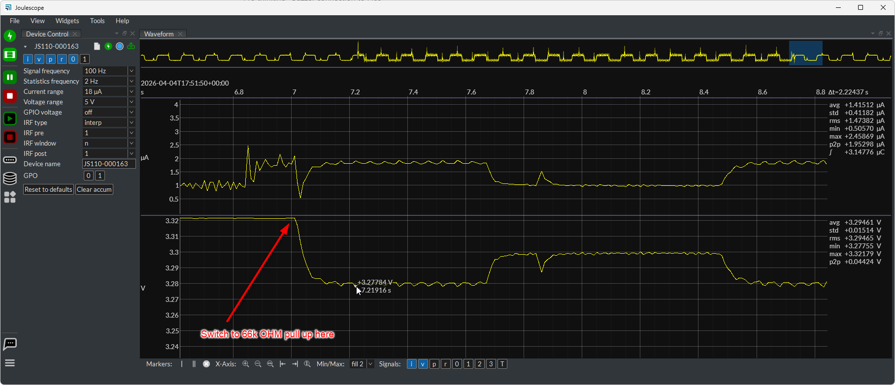

# Target Current Measurement

After programming an MSP430, we want to verify it entered low-power mode
by measuring its current draw. We do this without any external current
sense hardware — just the Pico's built-in pull-up resistor and ADC.

## How It Works

The VCC pin (GP27) serves double duty: GPIO output for powering the target
during programming, and ADC input with internal pull-up for current
measurement afterward.

## Empirical confirmation

Here is a Joulescope trace of the current vs voltage for a load that flips between 1uA and 2uA every second
when powered though the pull-up on my Pi Pico (calibration measured 66.4k OHM)...



### Measurement cycle

1. Program and verify the target normally (VCC driven by GPIO)
2. Float the clock and data pins to eliminate leakage current paths
3. Call `power_via_pullup()` to switch VCC to pull-up
4. Wait for the RC circuit to settle (caller controls settle time)
5. Call `measure_current_ua(r_pullup, window_ms)` which averages ADC
   readings over the window and computes `I = (3.3V - V_measured) / R_pullup`
6. If voltage is below brownout threshold, returns `None` (target drawing too much)

The internal pull-up acts as a current sense resistor.
The target draws current through it, creating a voltage drop proportional
to the current.

### Parameters you need to know

There are three things you need to characterize for your specific setup:

**1. Pull-up resistance** — needed to convert voltage drop to current.
The Pico internal pull-ups are not precisely specified (~50–80kΩ) and
vary between chips. Run the one-time calibration (see below) to measure
yours and save it in `calibration.json`. Mine measured 66.4kΩ.

**2. Total decoupling capacitance** — determines how long you need to wait
after switching from GPIO drive to pull-up before the voltage settles to
steady state. The RC time constant is `τ = R_pullup × C_total`. You need
to wait roughly 3–5τ for accurate readings. With our 66.4kΩ pull-up and
1µF decoupling cap, τ ≈ 66ms so full settling takes ~300ms. In
practice we found that ~150ms was enough for the initial transient to
die out and get usable readings — see the trace in `current_measure.png`.

**3. Load noise amplitude and period** — determines how many samples you
need to average over. If your target has a periodic current variation
(like an LCD driver toggling segments), you need to average over at least
one full cycle to get a representative reading. Our MSP430FR4133 with LCD
shows ~80mV ripple on a ~200ms cycle, so we use `window_ms=100` which
covers several full cycles and lets the ADC sample continuously.

### Brownout detection

When switching from GPIO drive to pull-up, the target might not be in
low-power mode. If it's drawing milliamps, the pull-up can't sustain the
voltage and the target will brown out. The decoupling cap smooths the
transition but can't prevent brownout if the load is too heavy.

After the caller's settle time, `measure_current_ua()` checks whether the
voltage has stabilized above the brownout threshold (default 1700 mV). If
it hasn't, the function restores GPIO drive ("rescue") and returns `None`.
The caller can treat this as a "target not in LPM" signal.

### Sensitivity

At our measured pull-up of 66.4kΩ:

| Target current | Voltage drop | ADC counts (of 65535) |
|----------------|-------------|----------------------|
| 0.5 µA | 33 mV | ~655 |
| 1 µA | 66 mV | ~1310 |
| 5 µA | 332 mV | ~6553 |
| 10 µA | 664 mV | ~13107 |
| 50 µA | 3.3V | saturated (target browns out) |

The practical measurement range is roughly 0.5–30 µA. Below 0.5 µA the
signal is small but still detectable with averaging. Above ~30 µA the
voltage drops too much for the target to operate reliably.

## Calibration

The internal pull-up resistance is not precisely specified (~50–80kΩ) and
varies between chips and with temperature. A one-time calibration step
measures the actual value using a known external resistor.

### What you need

A resistor with known value, ideally 1% tolerance. We use 1.1MΩ. The
value should be much larger than the pull-up (~66kΩ) so the pull-up
dominates the voltage divider and gives a clear reading, but not so large
that the voltage barely changes.

### Procedure

1. Disconnect the target
2. Connect the calibration resistor from GP27 (VCC pin, Pico pin 32) to GND
3. From the MicroPython REPL:

```python
import current_measure_calibrate
```

This runs the calibration and saves the result to `calibration.json`.

### How calibration works

With the calibration resistor connected, the pull-up and the resistor form
a voltage divider:

```
3.3V --- [R_pullup] ---+--- [R_cal] --- GND
                        |
                       ADC reads here
```

The ADC measures the midpoint voltage:

```
V = 3.3 × R_cal / (R_pullup + R_cal)
```

Solving for the pull-up resistance:

```
R_pullup = R_cal × (3.3 / V - 1)
```

The calibrated value is stored in `calibration.json` and loaded by the
programming loop at startup.

### Temperature drift

The internal pull-up resistance drifts ~0.5–1%/°C. Over a typical indoor
temperature range (20–30°C), expect ~5–10% variation from the calibrated
value. This is fine for go/no-go LPM verification (distinguishing 2µA
from 200µA) but not for precision measurement.

To improve accuracy, you could recalibrate periodically. The calibration
resistor itself has negligible temperature drift (1% metal film resistors
are typically ±50 ppm/°C).

The RP2350 has an onboard temperature sensor (`machine.ADC(4)`) that could
be used for temperature compensation, but the pull-up's temperature
coefficient isn't well characterized enough to make this worthwhile in
practice.

## Files

| File | Purpose |
|------|---------|
| `target_power.py` | `load_calibration()`, `power_via_pullup()`, and `measure_current_ua()` on the `TargetPower` base class |
| `current_measure_calibrate.py` | Standalone calibration script, saves `calibration.json` |
| `calibration.json` | Stored pull-up resistance value (generated, not committed) |

## Future: Capacitor Discharge Method

An alternative approach that avoids the pull-up resistance uncertainty
entirely: disconnect power and measure the voltage decay rate on the
decoupling cap.

```
I = C × dV/dt
```

With 1µF cap and 5µA load: dV/dt = 5 mV/ms → 50mV drop over 10ms.

### Advantages over pull-up method

- No pull-up resistance uncertainty — only depends on capacitor value
- Temperature independent (ceramic cap drift is much smaller than
  pull-up drift)
- Wider measurement range (not limited by pull-up voltage drop)

### Challenges

- Need to know the capacitance accurately. Ceramic X5R/X7R caps can be
  20–80% of rated value depending on DC bias and tolerance
- Could calibrate C using a known load resistor and measuring decay rate
  (same approach as pull-up calibration)
- ADC parasitic load is negligible: ~50–80nA pin leakage + ~16pA from
  sample-and-hold charging. Both are <100nA total, well under 1% of the
  expected µA-level signal

### Not yet implemented

For my use case, I already do the decay measurement on the target itself so no need to  to repeat it here- 
the pull-up method is simpler and sufficient for go/no-go LPM current verification.
